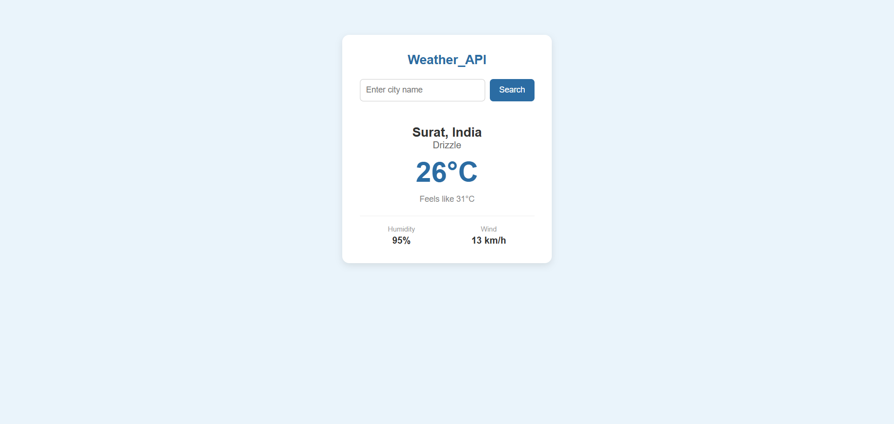
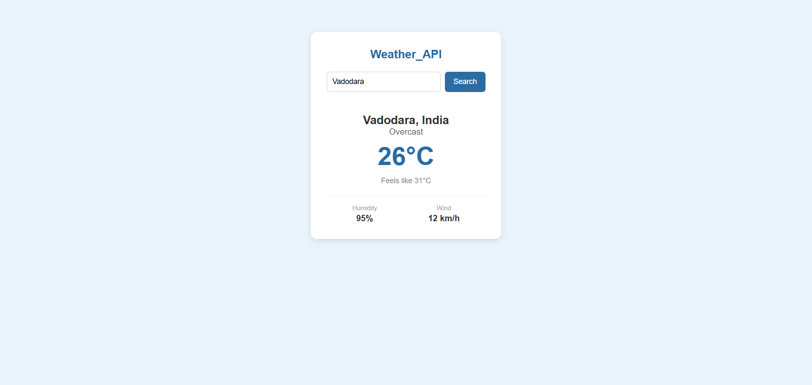

# Weather API

A simple weather api is built using HTML, CSS and JavaScript and You can search any city and it shows the current weather, humidity and wind speed.

## Files

- weather.html 
- weather.css 
- weather.js 

## Output-Screenshot

## API used

I used the Open-Meteo API (https://open-meteo.com/) because it's free and easy to use.

It works in 2 steps:
1. First I send the city name to their geocoding API, which gives back latitude and longitude
2. Then I use those coordinates to get the actual weather from their forecast API

## Features

- Search weather by city
- Shows temperature, feels like, humidity and wind speed
- Loads Surat's weather by default when you open it
